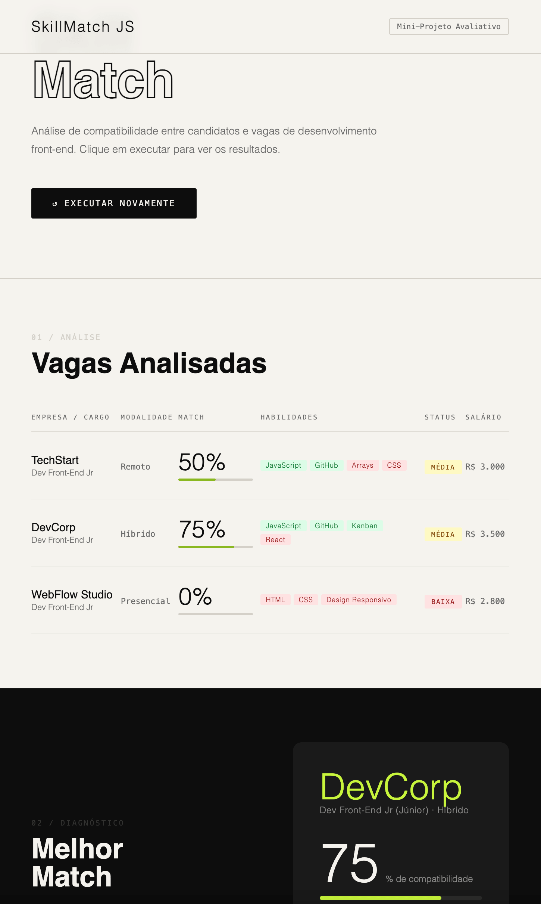

## Como Executar

#### Terminal / Node.js

```bash
node skillmatch.js
```

#### Interface Visual

1. Abrir o arquivo principal no navegador ➔ index.html

2. Iniciar a simulação ➔ Na tela principal da interface, clique no botão "Executar Análise".

3. Visualize e interaja com os gráficos de compatibilidade gerados dinamicamente.

## SkillMatch JS — Interface de Match Front-End

[](https://skillmatch-js.vercel.app/)

## Demonstração: Projeto SkillMatch JS

🔗 [Vercel (Deploy)](https://skillmatch-js.vercel.app/)

## Tecnologias Utilizadas

- JavaScript
- HTML5
- CSS3
- VS Code
- GitHub
- GitHub Desktop
- Kanban

## Conceitos de JavaScript Aplicados

- Variáveis (const, let, var)
- Tipos de dados
- Condicionais
- Operadores
- Estruturas de repetição
- Funções
- Arrow Functions
- Arrays
- Objetos
- Métodos de array
- POO
- Classes
- Herança
- Callbacks
- Closures
- Promises
- Async/Await

## Como a internet funciona

A internet funciona como uma rede global de computadores conectados entre si.

Quando um usuário acessa um site:

1. O navegador envia uma requisição;
2. O servidor recebe essa requisição;
3. O servidor retorna os dados;
4. O navegador exibe o conteúdo.

Esse modelo é conhecido como arquitetura cliente-servidor.

No projeto, a função com Promise simula uma busca de dados em um servidor.

## Organização Trello (Kanban)

- Material de apoio
- Pronto para iniciar
- Desenvolvendo
- Pausado
- Concluido

## Tarefas do Projeto

#### Estrutura Inicial

- [x] Criar pasta do projeto
- [x] Criar arquivo `skillmatch.js`
- [x] Criar arquivo `README.md`
- [x] Criar `index.html`
- [x] Criar `style.css`

#### Desenvolvimento

- [x] Criar array de vagas
- [x] Criar cálculo de compatibilidade
- [x] Criar classificação por percentual
- [x] Criar listagem de habilidades faltantes
- [x] Encontrar melhor vaga
- [x] Criar recomendação de estudo

#### JavaScript Avançado

- [x] Aplicar map
- [x] Aplicar filter
- [x] Aplicar reduce
- [x] Aplicar find
- [x] Aplicar every
- [x] Criar classe Vaga
- [x] Criar herança VagaFrontEnd
- [x] Demonstrar uso de this
- [x] Criar callback
- [x] Criar closure
- [x] Criar Promise
- [x] Aplicar async/await

#### Organização e Entrega

- [x] Criar repositório GitHub
- [x] Criar branches (main, develop, feat/analise-vagas, docs/readme)
- [x] Realizar commits (mínimo 5)
- [x] Atualizar README
- [x] Testar sistema
- [x] Gravar vídeo (máximo 5 minutos)
- [x] Enviar links no AVA

## Links do Projeto:

🔗 [Vercel (Deploy)](https://skillmatch-js.vercel.app/)

🔗 [Trello (Kanban)](https://trello.com/invite/b/6a138cdef4f67243b42956ac/ATTIe37fb1a53ce14355f5d31302e99152b2B8B87FED/skillmatch-js)

🔗 [Repositório GitHub](https://github.com/marcelfcampos/SKILLMATCH-JS)

## Redes Sociais:

🔗 [LinkedIn](https://www.linkedin.com/in/marcelfcampos/)

🔗 [Instagram](https://www.instagram.com/arqmarcelcampos/)

🔗 [GitHub](https://github.com/marcelfcampos)

## Autor: Marcel Ferreira Campos

Formado em Arquitetura e Urbanismo, trago para a área de tecnologia a combinação entre pensamento criativo e estruturado, aplicando conceitos de design, usabilidade e lógica construtiva ao desenvolvimento de interfaces digitais.
